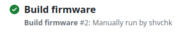
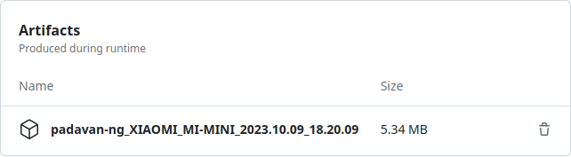
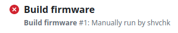
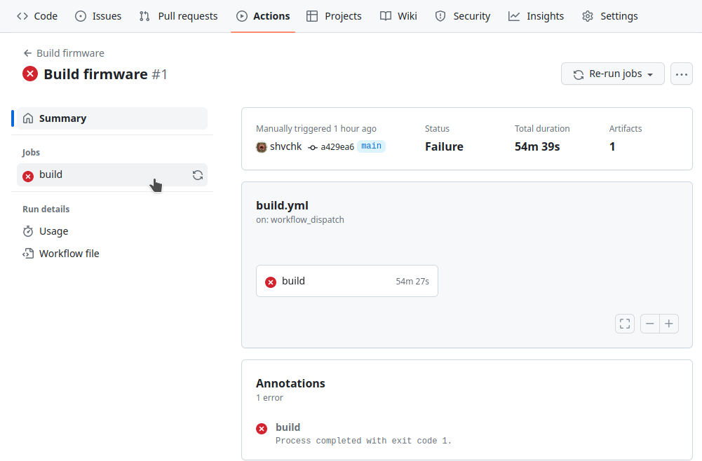
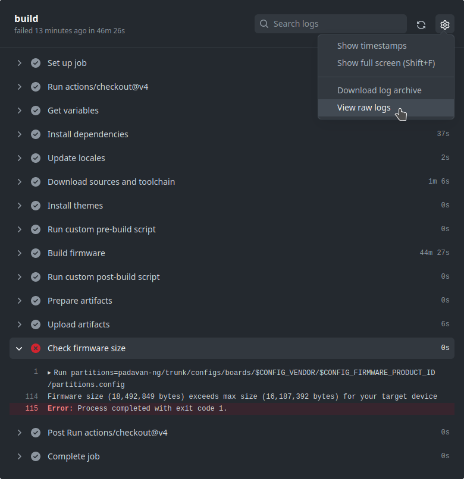

<a href="README.md">English</a> | Русский

## Автоматическая сборка прошивки Padavan на серверах GitHub

### Использование

- [Форкните репозиторий](https://github.com/shvchk/padavan-builder-workflow/fork), дальнейшие шаги выполняйте в своём форке

- Скопируйте свой конфиг сборки в [`build.config`](build.config)

  Шаблон конфига для вашего устройства можно взять в [репозитории прошивки](https://gitlab.com/hadzhioglu/padavan-ng/-/tree/master/trunk/configs/templates)

- Запустите сборку: Actions → Build firmware → Run workflow

  

  На странице появится запущенный процесс сборки (если не появляется, просто обновите страницу). Подробности о процессе можно узнать, нажав на него.

  В зависимости от конфига, сборка обычно занимает от 10 до 60 минут.

- Пока процесс выполняется, индикатором статуса процесса будет золотистый круг

  

- Если процесс завершится успешно, индикатор статуса процесса станет зелёным с галочкой

  

  Нажмите на завершённый процесс. Архив с прошивкой будет хранится в его артефактах:

  

  Лицензия прошивки не подразумевает распространения готовых сборок, поэтому архив с прошивкой для личного пользования хранится в течение 7 дней.

- Если процесс завершится с ошибкой, индикатор статуса процесса станет красным с крестиком

  

  Нажмите на завершённый процесс. Для получения подробностей об ошибке нажмите на завершившуюся с ошибкой задачу `build` слева:

  

  Откроется отчёт о выполнении задачи:

  

  Здесь сразу видно, что ошибка возникла на шаге Check firmware size — проверки размера прошивки — этот шаг отмечен красным кружком с крестиком. Далее указана конкретная причина: *Firmware size (18,492,849 bytes) exceeds max size (16,187,392 bytes) for your target device* — то есть размер собранной прошивки превышает максимально допустимый для устройства размер.

  В случае любых ошибок причина обычно указана в конце лога, как в примере выше. Для просмотра полного лога нажмите на шестерёнку ⚙️ в верхнем правом углу и выберите View raw logs. Можно также загрузить сжатый архив с логом, выбрав Download log archive.

  Если не удалось разобраться в причине ошибки самостоятельно, можно обратиться за помощью к сообществу или разработчику прошивки. В таком случае не забудьте приложить архив с логом.

### Обновление форка

Чтобы синхронизировать ваш форк с репозиторием-источником, просто нажмите Sync fork в верхней части главной страницы вашего форка:

### Дополнительные возможности

Вы можете указать репозиторий прошивки, ветку, конкретный тег или коммит в файле [`variables`](variables).

В файле [`variables`](variables) также можно указать необходимые для установки темы, раскомментировав их в переменной `PADAVAN_THEMES`. Репозиторий с темами можно указать в переменной `PADAVAN_THEMES_REPO`.

Вы можете создать скрипт `pre-build.sh` с любыми кастомными командами, который будет выполнен непосредственно перед процессом сборки. К тому времени исходный код прошивки уже загружен, так что вы можете добавлять в него или изменять в нём что угодно.

Вы можете создать скрипт `post-build.sh`, который будет выполнен сразу после процесса сборки.

---

Обсуждение: https://github.com/shvchk/padavan-builder-workflow/discussions/categories/общее
